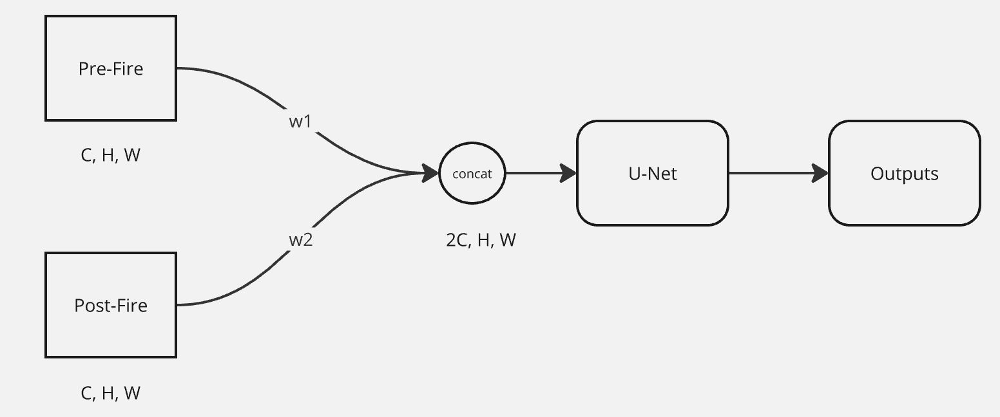

# Forest_Burned_Area_Detection
Term Project for CSC 791- Geospatial  AI

All the notebooks are present in the [`notebooks`](./notebooks/) directory. The dataset is taken from the paper [CaBuAr: California Burned Areas dataset for delineation ](https://arxiv.org/abs/2401.11519), and the dataset is available on [huggingface](https://huggingface.co/datasets/DarthReca/california_burned_areas). The dataset consists of both post-fire and pre-fire images so we've identified two different tasks to work on 
- [Image Segmentation](#best-performing-model-for-image-segmetntation)
- [Image Segmentation via Change Detection](#best-performing-model-for-change-detection)
# Best Performing Model for Image Segmentation
The code can be found in [`notebooks/Post_Fire`](./notebooks/Post_Fire) directory.
We were able to beat the baseline results provided by them using the spectral indices.
| Model Variant       | F1-Score|
|---------------------|----------|
| UNet(ours using spectral indices)   | 80%      |
| UNet (baseline)   | 70.7%      | 
# Best Performing Model for Change Detection

## The architecture
The architecture is as shown 
It beats the baseline provided by the paper by a significant margin as shown in the table. 
| Model Variant       | F1-Score | IOU |
|---------------------|----------|-----|
| UNet (Weighted Concat)      | 88%      | 67% |
| UNet     | 62%      | 49.5% |

The code with various experiments run can be found in the notebooks in the [`notebooks/Change_Detection`](./notebooks/Change_Detection) directory.
